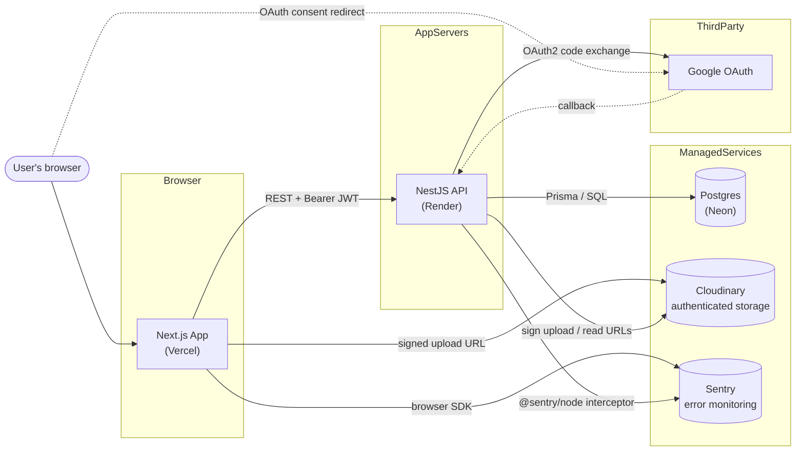
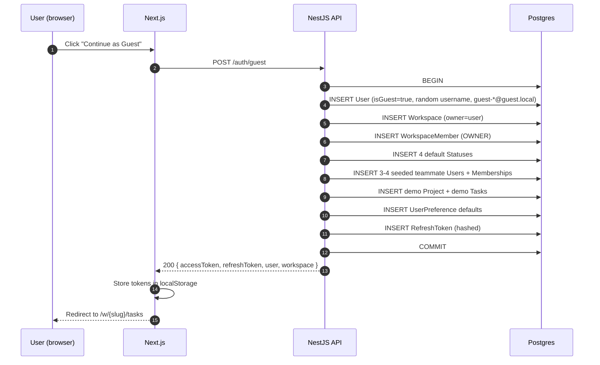
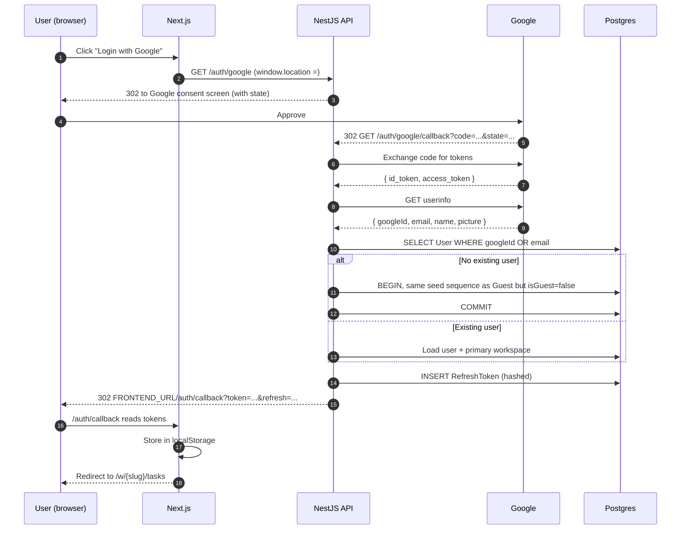
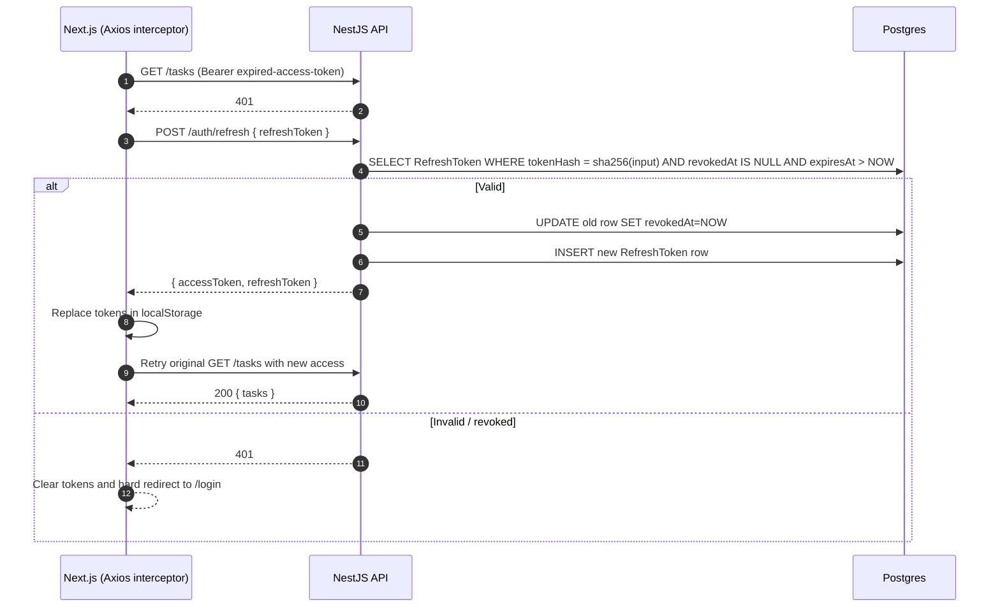
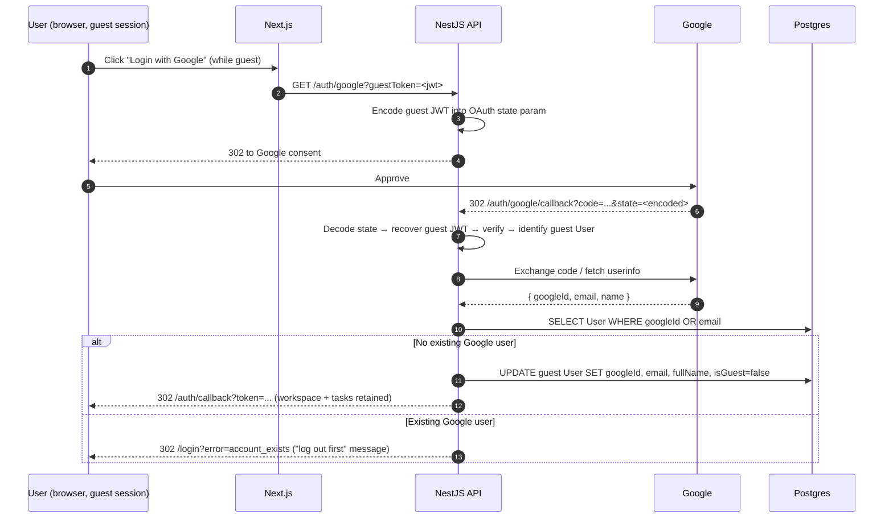
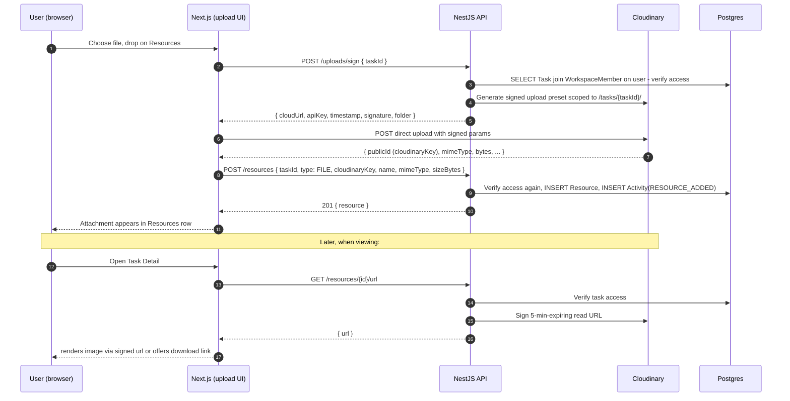

# Architecture

How the pieces fit together and how requests flow through them.

## Top-down system diagram

## Component responsibilities

### `apps/web` — Next.js frontend (Vercel)

- App Router with route groups for auth (`(auth)/…`) and app shell (`(app)/w/[slug]/…`).
- Server components for initial data fetches where SEO/perf helps; client components for interactive surfaces (Board, Task Detail modal).
- **TanStack Query** owns all server state — caches queries by `[entity, workspaceSlug, id]`, invalidates on mutation, supports optimistic updates for drag-and-drop.
- **Zustand** owns UI state (accent color, sidebar collapsed, modal open).
- **Axios** client with interceptors: attach `Authorization: Bearer <access>`, catch 401 → silent refresh → retry.
- **Intercepted routes** for the Task Detail modal — internal navigation opens modal, direct visit renders full page.
- **Sentry (`@sentry/nextjs`)** auto-instruments App Router, captures Web Vitals, uploads source maps at build time.

### `apps/api` — NestJS backend (Render)

- One module per entity (`AuthModule`, `TasksModule`, `ProjectsModule`, `ResourcesModule`, …).
- Global `ValidationPipe({ whitelist, forbidNonWhitelisted, transform })` — mass-assignment protection.
- Global guards: `JwtAuthGuard` (default, decorate `@Public()` to skip), `WorkspaceMemberGuard` (verifies URL `slug` is one of the user's memberships).
- Global interceptor: `SentryInterceptor` — captures unhandled exceptions with request-id context.
- Global middleware: `RequestIdMiddleware` — assigns/echoes `x-request-id` and injects into pino log context.
- **Prisma** as the only DB layer. Zero raw SQL except in migrations. Row-level filtering enforced in service methods, not by clients.
- **Passport** strategies: `JwtStrategy`, `GoogleStrategy`, custom `GuestStrategy`.
- Swagger docs served at `/api/docs` — decorators derive the schema from the code.
- **@nestjs/throttler** enforces rate limits layered per route.

### `packages/shared`

- Enums (`Priority`, `Role`, `ActivityType`, …) and zod schemas for every DTO.
- Both apps import from `@task-mgmt/shared` — one source of truth for request/response shapes.
- No runtime code beyond zod schemas; TypeScript types are derived via `z.infer<>`.

### Postgres (Neon in prod, Docker in dev)

- Single logical DB. All entities live under the `public` schema.
- Prisma migrations tracked in `apps/api/prisma/migrations/` and applied via `prisma migrate deploy` on Render start-up.
- Local dev uses `docker-compose.yml` — Postgres 16 on **host port 5433** (avoids conflict with native Windows Postgres).

### Cloudinary

- Storage type `authenticated` for all task attachments — objects are private by default.
- Uploads: backend signs an upload preset scoped to a specific task; browser uploads direct to Cloudinary.
- Reads: backend mints a 5-minute signed URL after verifying task access.

### Sentry

- Two projects: `task-mgmt-web` and `task-mgmt-api`.
- Environment tag: `development` / `production`.
- Request-id (from pino) attached as a tag so backend and frontend events for the same user action can be correlated.

---

## Auth sequence — Guest Login

## Auth sequence — Google OAuth (new user)

## Auth sequence — Silent refresh on 401

## Auth sequence — Guest → Google merge (P1)

---

## File upload sequence

---

## Request lifecycle (typical authenticated call)

1. Frontend attaches `Authorization: Bearer <access>` and `x-request-id` (generated client-side for correlation).
2. **`RequestIdMiddleware`** ensures a request-id exists (echoes client's or generates one) and stamps it on pino's async context.
3. **`ThrottlerGuard`** (global) checks rate-limit bucket for this IP or user.
4. **`JwtAuthGuard`** (global) validates the access token, hydrates `req.user`.
5. **`WorkspaceMemberGuard`** (route or module level) resolves `slug` from URL, verifies membership, injects `req.workspace`.
6. **`ValidationPipe`** (global) whitelists / transforms body against the DTO.
7. Controller → Service → Prisma. Service enforces workspace-scoped queries: `where: { workspaceId: req.workspace.id, ... }`.
8. If the mutation changes stateful fields, the service writes both the entity update and an `Activity` row in the **same Prisma transaction**.
9. **`SentryInterceptor`** wraps everything — unhandled errors get captured with request-id, user id, workspace slug tagged.
10. Response serialised via `ClassSerializerInterceptor` — `@Exclude`d fields (`passwordHash`, `googleId`, `tokenHash`) never leak.

---

## Deployment topology

| Concern          | Choice              | Why                                                      |
| ---------------- | ------------------- | -------------------------------------------------------- |
| Web hosting      | **Vercel**          | Native Next.js, edge network, zero-config deploys        |
| API hosting      | **Render**          | Free tier for web services, native Docker, easy env vars |
| Database         | **Neon** (Postgres) | Best free tier, branching, serverless                    |
| File storage     | **Cloudinary**      | Generous free tier, signed uploads/reads out of the box  |
| Error monitoring | **Sentry**          | Best-in-class for JS/TS + Next.js + Nest                 |
| Secrets          | Provider dashboards | Never in git                                             |
| CI               | **GitHub Actions**  | Lint + typecheck + test on PR                            |

## Env vars (see `apps/*/.env.example`)

- `apps/api`: `DATABASE_URL`, `JWT_SECRET`, `JWT_ACCESS_TTL`, `JWT_REFRESH_TTL`, `GOOGLE_CLIENT_ID`, `GOOGLE_CLIENT_SECRET`, `GOOGLE_CALLBACK_URL`, `FRONTEND_URL`, `CLOUDINARY_*`, `SENTRY_DSN`, `THROTTLE_*`.
- `apps/web`: `NEXT_PUBLIC_API_URL`, `NEXT_PUBLIC_SENTRY_DSN`, `SENTRY_ORG/PROJECT/AUTH_TOKEN` (for source-map upload at build time).
