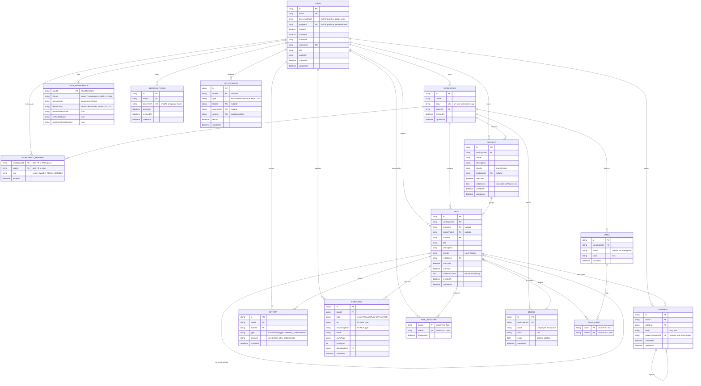

# Data Model (ER Diagram)

The authoritative source is `../apps/api/prisma/schema.prisma`. This document explains the model visually and captures the reasoning behind each decision.

## Diagram

> **Note on the diagram syntax:** Mermaid's ER grammar doesn't have `enum`, `text`, or `json` primitives, so those fields are drawn as `string` with the actual type/enum captured in the trailing comment. Composite keys are shown by marking each column `PK`; the `also FK to X` comment records the foreign-key half. The Prisma schema in `apps/api/prisma/schema.prisma` remains the authoritative source.

---

## Enums

- **Priority:** `NONE | URGENT | HIGH | MEDIUM | LOW`
- **Role:** `OWNER | ADMIN | MEMBER`
- **ResourceType:** `LINK | FILE`
- **ActivityType:** `TASK_CREATED | TASK_UPDATED | STATUS_CHANGED | PRIORITY_CHANGED | DUE_DATE_CHANGED | MEMBER_ADDED | MEMBER_REMOVED | LABEL_ADDED | LABEL_REMOVED | COMMENT_ADDED | RESOURCE_ADDED | USER_UPDATE`
- **ThemeMode:** `LIGHT | DARK`
- **AccentColor:** `AMBER | BLUE | PINK | ROSE | EMERALD | BLACK`
- **DefaultView:** `BOARD | LIST`
- **NotificationType:** `MENTION`

---

## Design notes

### IDs

- All primary keys use `cuid()` — URL-safe, sortable by creation time, no auto-increment enumeration risk. Preferred over UUID v4 for API URLs.

### Multi-tenancy — every entity carries `workspaceId`

- All top-level entities (`Status`, `Project`, `Task`, `Label`) reference a `Workspace`. This is the foundation of row-level authorization: every query filters by workspaces the requester is a member of. A workspace slug in the URL is validated against `WorkspaceMember` in a global guard before any handler runs.

### Cascade behavior

| Delete            | Cascades to                                                                         | Why                                                             |
| ----------------- | ----------------------------------------------------------------------------------- | --------------------------------------------------------------- |
| `Workspace`       | `WorkspaceMember`, `Status`, `Project`, `Task`, `Label` (and everything under them) | A deleted workspace should leave no orphaned data.              |
| `Task`            | `TaskAssignee`, `TaskLabel`, `Comment`, `Resource`, `Activity`                      | Same principle at the task level.                               |
| `User`            | `WorkspaceMember`, `RefreshToken`, `UserPreference`, `Notification` (recipient)     | Cleanup of pure user-owned side data.                           |
| `Project`         | none (Task's `projectId` set to null)                                               | Deleting a project shouldn't nuke its tasks.                    |
| `Task.parentTask` | its subtasks                                                                        | If the parent goes, the subtasks go — matches user expectation. |

Content-authored fields (`Task.reporterId`, `Comment.authorId`, `Activity.actorId`, `Resource.uploadedById`, `Notification.actorId`) are **not** null-set on user delete, and Prisma will `Restrict` such deletions. In practice, users don't get deleted directly — guests are cleaned up by first deleting their workspace (cascade) and then the user row.

### Custom statuses per workspace

- `Status` is workspace-scoped. Every new workspace seeds with 4 defaults (To Do, Doing, Completed, On Hold), but users can add/rename/reorder/delete. Deleting a status with tasks prompts the user to move them elsewhere first.
- `Status.order` is a **float** so columns can be reordered without rewriting siblings (halve the gap when inserting between two).
- `(workspaceId, name)` unique to prevent duplicate names in a workspace.

### Fractional indexing for `Task.orderInColumn`

- Float column, defaults to 0. When dragging a task to a new position between two neighbors with orders X and Y, the new task gets `(X + Y) / 2`. No sibling rewrites needed.
- Rebalancing (needed after enough sub-halving to hit float precision limits) is a background job — not needed for demo scale.

### Subtasks

- Modeled as a self-relation on `Task` via `parentTaskId`. UI stops at one level of nesting for v1; the backend supports arbitrary depth if we later choose to render it.

### Comments — one level of reply

- `Comment.parentCommentId` is nullable. Top-level comments have it null; replies point at the parent. UI does not render replies-of-replies (matches Figma, matches Jira/Linear behavior).

### Activity — one table, flexible payload

- `Activity.payload` is JSONB, holding whatever the event type needs (typically `{ before, after }` plus contextual fields like `note` for USER_UPDATE).
- Activity rows are written by the backend inside the same transaction as the mutation. Never trust the client to log history.

### Resource — link or file, one table

- `type = LINK`: `url` is filled, `cloudinaryKey` is null.
- `type = FILE`: `cloudinaryKey` is filled, `url` is null. Rendering requires `GET /resources/:id/url` which returns a 5-minute signed Cloudinary URL after verifying task access.

### UserPreference — 1:1 with User

- Primary key is `userId` itself (no surrogate id). One row per user. Missing row = defaults apply.
- `boardFieldsShown` / `listFieldsShown` / `projectListFieldsShown` are JSON blobs like `{ priority: true, dueDate: true, labels: false }` — dynamic field-visibility toggles.

### RefreshToken — hashed at rest

- The token itself is opaque random bytes (never a JWT). Only the SHA-256 hash is stored.
- Rotation: every `/auth/refresh` inserts a new row and sets `revokedAt` on the old one. Enables detection of token reuse (theft signal).

### Notification — poll-based for v1

- Only `MENTION` type in v1 (P2 feature). Recipient identified by `userId`. `actorId` is who mentioned them. Optional `taskId` and `commentId` deep-link the target.
- Read state is a nullable timestamp (`readAt`), not a boolean — records when the user saw it.

---

## Indexes (for common queries)

- `Task(workspaceId, statusId, orderInColumn)` — the Kanban board query.
- `Task(projectId)` — Project detail view.
- `Task(parentTaskId)` — Subtasks lookup.
- `Task(dueDate)` — overdue checks and date-range filters.
- `Status(workspaceId, order)` — column ordering.
- `Activity(taskId, createdAt)` — activity feed pagination.
- `Comment(taskId)` — task comments load.
- `Comment(parentCommentId)` — reply threading.
- `WorkspaceMember(userId)` — "which workspaces am I in" query.
- `TaskAssignee(userId)` — "my tasks" filter.
- `Notification(userId, readAt)` — unread count query.

---

## Seed data per workspace (on signup / guest creation)

- 4 `Status` rows: To Do (grey), Doing (blue), Completed (green), On Hold (amber).
- 3–4 `User` rows with `isSeeded = true` and matching `WorkspaceMember` rows — populate the assignee dropdown.
- 1 `Project` (`"Homepage Redesign"`) with priority and lead.
- 5–6 demo `Task` rows spread across statuses, with labels and assignees.

Seed script: `apps/api/prisma/seed.ts`.
